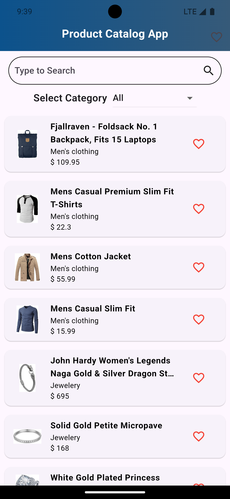
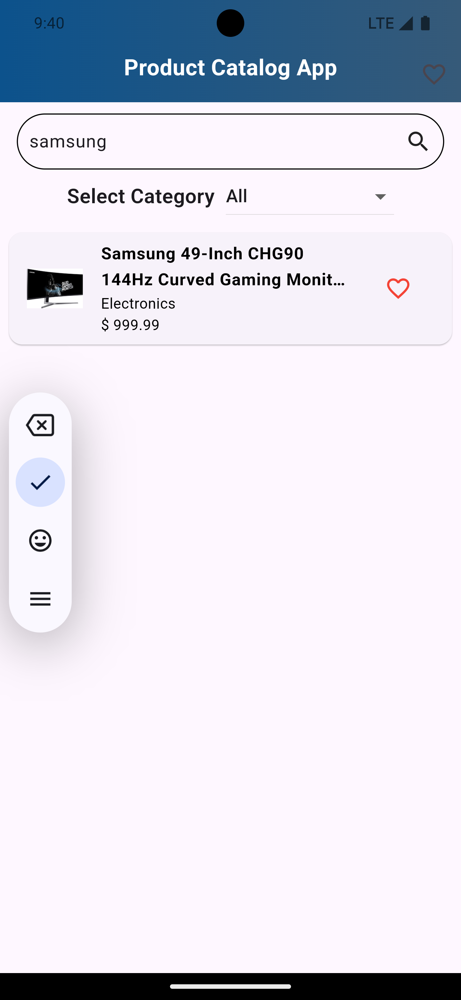
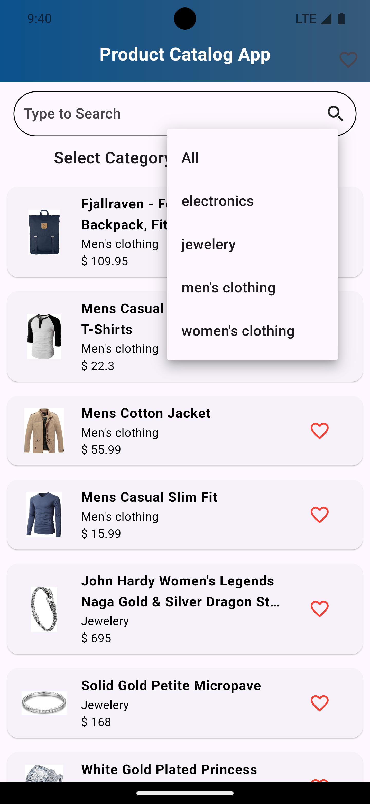
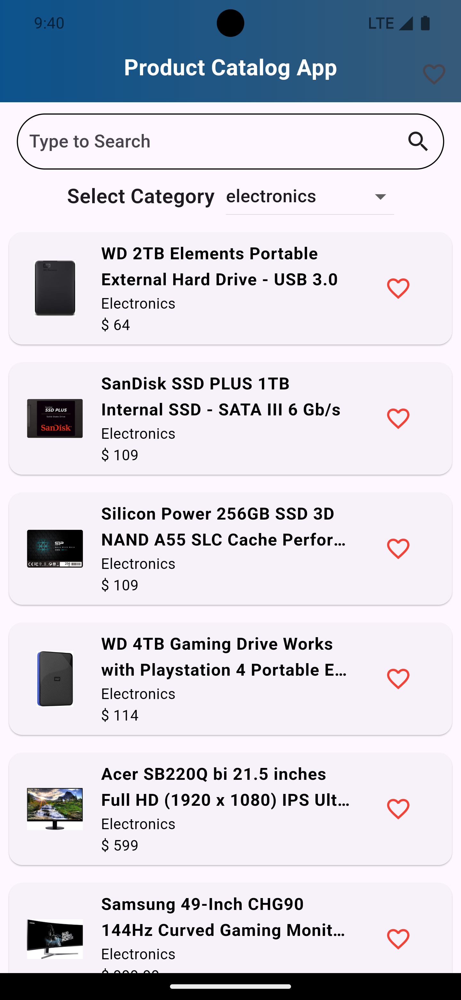
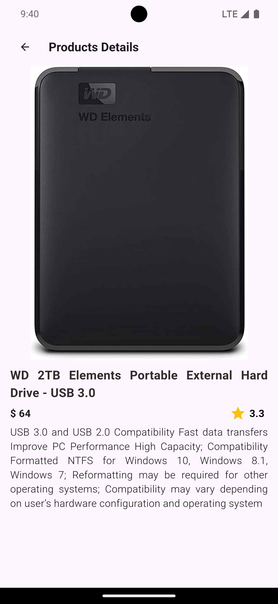
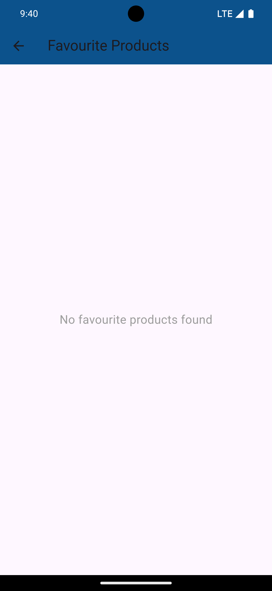
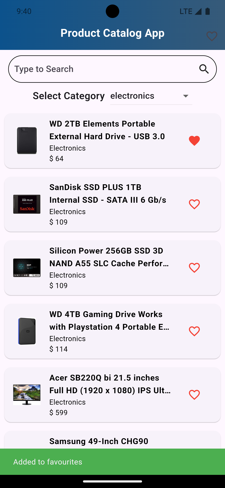
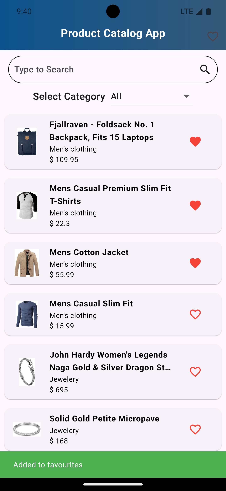
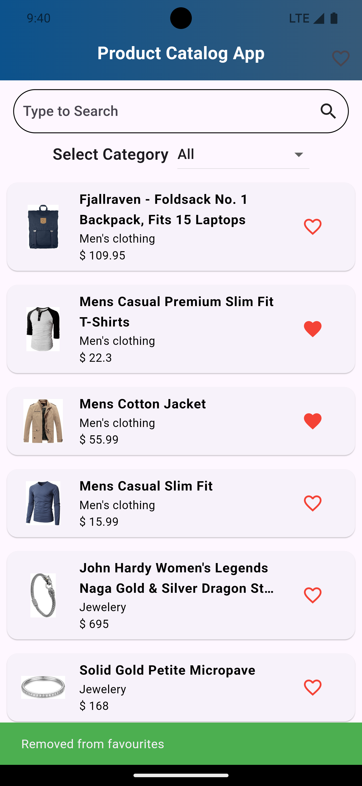
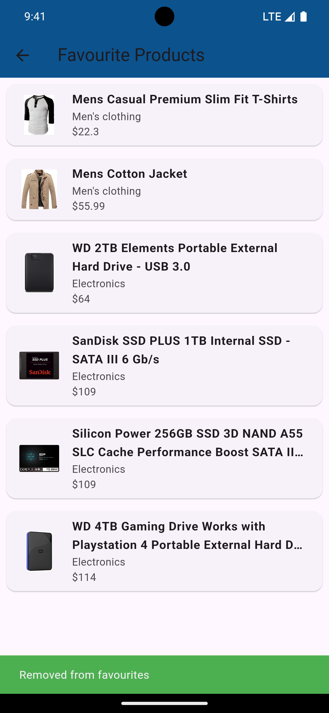

# Product Catalogue App
========================

This app fetches product data from the [Fake Store API](https://fakestoreapi.com/) and displays it on a user-friendly UI with search, filter, and **Mark as Favourite** features. The app uses Hive for local storage to provide a seamless experience and follows the MVC architecture to ensure scalable and maintainable code.

---

## Features
-----------

- Displays a catalogue of products fetched from the Fake Store API.
- Search functionality to find products based on user input.
- Filter products by categories (e.g., electronics, clothing, etc.).
- **Mark products as favourites** and add them to a dedicated favourites list.
- Local storage for offline access using Hive (including favourite products).
- Scalable codebase based on the MVC (Model-View-Controller) architecture.

---

## Project Architecture
------------------------

1. **Frontend**:
   - Flutter-based Android app.
   - Uses Hive for local data storage (including favourites).
   
2. **Backend**:
   - Fetches product data from the Fake Store API.
   - Real-time updates are fetched on each app launch.

---

## Screenshots
-------------

   
   
   
   
   
    
   
   
   
   

---

## How to Clone and Run the Flutter App
----------------------------------------

### Prerequisites

1. Install Flutter on your system.
2. Install Android Studio or any preferred IDE for Flutter development.
3. Ensure you have a physical Android device or emulator set up.

### Steps

1. Clone the repository:

    ```bash
    git clone https://github.com/shashank77665/Product-Catalogue-App.git
    ```

2. Navigate to the app directory:

    ```bash
    cd Product-Catalogue-App
    ```

3. Install dependencies:

    ```bash
    flutter pub get
    ```

4. Connect an Android device or start an emulator.
5. Run the app:

    ```bash
    flutter run
    ```

